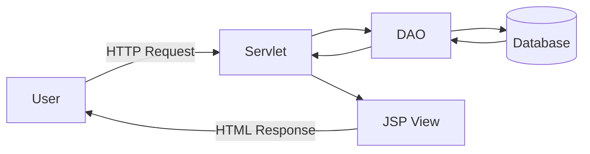

<h1 style="text-align: center;">Flight Management</h1>

Web app for managing flights for an airline company made in Java.

## Structure

## Requirements
* **Apache HTTP Server 2.4** - [Download](https://httpd.apache.org/download.cgi)
* **Apache Tomcat 10.1** - [Download](https://tomcat.apache.org/download-10.cgi)
* **MySQL 8.0** - [Download](https://dev.mysql.com/downloads/mysql/)
* A browser. I used **Google Chrome** (_awesome_)

I suggest the use of [XAMPP](https://www.apachefriends.org/download.html) app which has all the requirements but you will have to update those by deleting them and installing the versions mentioned above.
Also, use whatever IDE you like but I used IntelliJ Ultimate Edition
 for this project.
The main difference is that it provides configurations to run the Apache Tomcat Server
and build the project automatically. Otherwise, just build the project manually and copy paste the `.war` file inside the Apache Tomcat Server folder and open the app from there.
